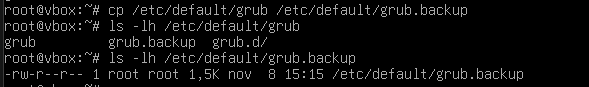

summary: Bastionado de Arranque en Debian 13.0.1
id: bastionado-arranque-debian
categories: ciberseguridad, linux, hardening
tags: ubuntu, luks, lvm, grub, seguridad, cifrado
status: Published
authors: Juan Pérez Ortega
Feedback Link: jperort689@g.educaand.es 

# Bastionado del Arranque en Debian

## Introducción
Duration: 0:05:00

En este apartado veremos como fortalecer la seguridad del proceso de arranque de un sistema Debian

## Preparación del Entorno
Duration: 0:08:00

Antes de comenzar con el bastionado de GRUB, es necesario verificar la instalación y crear copias de seguridad de la configuración actual.

### Objetivo

Asegurar que GRUB está correctamente instalado y proteger la configuración original mediante backups antes de realizar modificaciones.

Negative
: **Importante**: Realizar backups es una práctica de seguridad fundamental. Si algo falla durante el bastionado, podrás restaurar la configuración original.

### Paso 1: Verificar la versión de GRUB instalada

Primero, confirma que GRUB está instalado en el sistema.

La salida mostrará la versión de GRUB instalada en tu sistema Debian.

### Paso 2: Crear backup del archivo de configuración principal

El archivo `/etc/default/grub` contiene la configuración principal de GRUB. Crearemos una copia de seguridad en caso de poder cometer cualquier tipo de fallo

**Verificar que el backup se creó correctamente**:

### Paso 3: Crear backup del directorio de scripts de GRUB

El directorio `/etc/grub.d/` contiene scripts que generan el archivo de configuración final de GRUB.

Deberías ver tanto `grub.d` como `grub.d.backup`.

### Paso 4: Visualizar la configuración actual de GRUB

Antes de realizar cambios, examina el contenido del archivo de configuración.

## Proteger GRUB con Contraseña
Duration: 0:12:00

La configuración de una contraseña en GRUB es la medida de seguridad más importante para proteger el gestor de arranque contra modificaciones no autorizadas.

### Objetivo

Establecer un superusuario con contraseña cifrada que sea requerido para editar entradas de arranque o acceder a la línea de comandos de GRUB.

Negative
: **Advertencia**: Guarda la contraseña en un lugar seguro. Sin ella, no podrás modificar las opciones de arranque desde el menú de GRUB.

### ¿Por qué proteger GRUB con contraseña?

Sin protección, cualquier persona con acceso físico a la máquina puede:
- Editar las opciones de arranque presionando `e`
- Añadir `init=/bin/bash` para obtener acceso root sin contraseña
- Acceder a la línea de comandos de GRUB presionando `c`
- Modificar parámetros del kernel para deshabilitar seguridad

La contraseña de GRUB evita todas estas vulnerabilidades.

### Paso 1: Generar el hash de la contraseña

GRUB utiliza el algoritmo PBKDF2 para cifrar las contraseñas. Nunca se almacenan en texto plano.

Ejecuta el siguiente comando:

## Proteger GRUB con Contraseña
Duration: 0:12:00

La configuración de una contraseña en GRUB es la medida de seguridad más importante para proteger el gestor de arranque contra modificaciones no autorizadas.

### Objetivo

Establecer un superusuario con contraseña cifrada que sea requerido para editar entradas de arranque o acceder a la línea de comandos de GRUB.

Negative
: **Advertencia**: Guarda la contraseña en un lugar seguro. Sin ella, no podrás modificar las opciones de arranque desde el menú de GRUB.

### ¿Por qué proteger GRUB con contraseña?

Sin protección, cualquier persona con acceso físico a la máquina puede:
- Editar las opciones de arranque presionando `e`
- Añadir `init=/bin/bash` para obtener acceso root sin contraseña
- Acceder a la línea de comandos de GRUB presionando `c`
- Modificar parámetros del kernel para deshabilitar seguridad

La contraseña de GRUB evita todas estas vulnerabilidades.

### Paso 1: Generar el hash de la contraseña

GRUB utiliza el algoritmo PBKDF2 para cifrar las contraseñas. Nunca se almacenan en texto plano.

Ejecuta el siguiente comando:

**grub-mkpasswd-pbkdf2**

**Importante**: 
- Elige una contraseña fuerte (mínimo 8 caracteres, mayúsculas, minúsculas, números y símbolos)
- **Copia TODO el hash** desde `grub.pbkdf2.sha512...` hasta el final
- **Anota tu contraseña** en un lugar seguro

Ejemplo de contraseña fuerte: `GrubSecure2025!`

Positive
: **Tip**: Selecciona y copia el hash completo con el ratón antes de continuar. Lo necesitarás en el siguiente paso.

### Paso 2: Editar el archivo de configuración personalizada

Abre el archivo `/etc/grub.d/40_custom` con un editor de texto:

* **Propósito:** Este archivo sirve para que puedas **añadir tus propias opciones personalizadas al menú** (por ejemplo, para lanzar aplicaciones).
* **Instrucciones:** Simplemente debes **escribir las nuevas entradas** que quieras añadir **justo después de ese comentario**.
* **Advertencia Importante:** Te avisa que tengas **mucho cuidado de NO modificar la línea que dice "exec tail"** que (según el texto) se encuentra *antes* de ese comentario.

### En resumen

Es una sección del archivo donde puedes añadir tus propios lanzadores de aplicaciones de forma segura. La línea `exec tail` es fundamental para que el resto del menú se cargue correctamente, por lo que si la modificas o la borras, es muy probable que tu menú deje de funcionar.

### Paso 3: Añadir la configuración de contraseña

Al final del archivo, añade las siguientes líneas:

cat >> /etc/grub.d/40_custom << 'EOF'
set superusers="admin"
**password_pbkdf2 admin grub.pbkdf2.sha512.10000.**

**Qué hace**:
- Añade automáticamente las líneas al final del archivo
- Define `admin` como superusuario de GRUB
- Configura la contraseña cifrada usando tu hash

### Paso 4: Verificar el archivo editado

Confirma que los cambios se guardaron correctamente:

**cat /etc/grub.d/40_custom**

Deberías ver tu configuración de superusuario y contraseña al final del archivo.

### Paso 5: Aplicar los cambios actualizando GRUB

Para que la configuración tome efecto, regenera el archivo de configuración de GRUB:

**update-grub**

El comando `update-grub` lee los archivos en `/etc/grub.d/` y `/etc/default/grub` y genera el archivo final `/boot/grub/grub.cfg`.

### Paso 6: Verificar la configuración generada

Revisa que la contraseña se agregó correctamente al archivo de configuración final:

**grep -A 2 "superusers" /boot/grub/grub.cfg**

**set superusers="admin"** 

**password_pbkdf2 admin grub.pbkdf2.sha512.10000.**

Si ves estas líneas, la configuración es correcta.

### ¿Qué sucede ahora?

Cuando reinicies el sistema:

- El menú de GRUB se mostrará normalmente
- Si intentas presionar `e` para editar una entrada, **GRUB pedirá usuario y contraseña**
- Si intentas presionar `c` para acceder a la línea de comandos, **también pedirá credenciales**
- Solo el superusuario configurado puede realizar modificaciones

## Proteger Edición y Endurecer Menú
Duration: 0:10:00

Tras configurar la contraseña en GRUB, se refuerza el menú para impedir modificaciones no autorizadas y reducir la superficie de ataque.

### Objetivo

- Exigir autenticación para editar entradas (`e`) o abrir la consola (`c`)
- Deshabilitar el modo recuperación
- Ajustar el tiempo de espera del menú (timeout)

### Paso 1: Exigir autenticación en edición y consola

La protección por contraseña ya está activa si añadiste `set superusers` y `password_pbkdf2` en `/etc/grub.d/40_custom`. Solo es necesario regenerar y verificar.

Actualizar los cambios

**update-grub**

Verificar que el superusuario y la contraseña están presentes en grub.cfg

**grep -E 'set superusers|password_pbkdf2' /boot/grub/grub.cfg**

Positive
: **Prueba**: Tras reiniciar, al pulsar `e` (editar) o `c` (consola) GRUB debe pedir usuario y contraseña.

### Paso 2: Deshabilitar el modo recuperación

Evita las entradas “recovery” para no facilitar elevaciones de privilegios.

Eliminar posibles definiciones previas
**sed -i '/^GRUB_DISABLE_RECOVERY/d' /etc/default/grub**

Deshabilitar modo recuperación
**echo 'GRUB_DISABLE_RECOVERY="true"' >> /etc/default/grub**

Aplicar cambios
**update-grub**

### Paso 3: Ajustar el timeout del menú

Reduce el tiempo de exposición del menú y acelera el arranque.

**sed -i '/^GRUB_TIMEOUT_STYLE/d' /etc/default/grub**
**sed -i '/^GRUB_TIMEOUT/d' /etc/default/grub**
**echo 'GRUB_TIMEOUT=3' >> /etc/default/grub**

### Paso 4: Parámetros de seguridad del kernel

Añade parámetros de endurecimiento al kernel desde GRUB para mejorar la seguridad en tiempo de ejecución.

Limpiar definiciones previas
**sed -i '/^GRUB_CMDLINE_LINUX_DEFAULT/d' /etc/default/grub**

Activar AppArmor, auditoría y protecciones de memoria
echo 'GRUB_CMDLINE_LINUX_DEFAULT="quiet apparmor=1 security=apparmor audit=1 page_poison=1 vsyscall=none slab_nomerge slub_debug=FZ init_on_alloc=1 init_on_free=1"' >> /etc/default/grub

Una vez hecho aplicamos los cambios

**update-grub**

Ver parámetros efectivos del kernel
**cat /proc/cmdline**

### Paso 5: Verificación rápida

Confirma que no hay entradas de recuperación y que el timeout está aplicado.

Confirmar que no hay entradas de recuperación

**grep -i recovery /boot/grub/grub.cfg || echo "Recovery deshabilitado"**

Confirmar el timeout efectivo en grub.cfg

**grep -E '^set timeout=' /boot/grub/grub.cfg**

### Paso 6: Pruebas funcionales

1. Reinicia el sistema.  
2. En el menú de GRUB, intenta:
   - Pulsar `e` para editar una entrada → debe pedir usuario y contraseña.  
   - Pulsar `c` para abrir la consola → debe pedir usuario y contraseña.  
3. Arranca normalmente y confirma que el sistema inicia sin errores.

### Paso 7: Reversión rápida (si algo falla)

Si tras aplicar cambios algo no funciona como esperas:

Restaurar configuración original si hiciste backups previos

**cp /etc/default/grub.backup /etc/default/grub 2>/dev/null || true**
**cp -r /etc/grub.d.backup/* /etc/grub.d/ 2>/dev/null || true**

Regenerar configuración

**update-grub**

Reiniciar

**reboot**