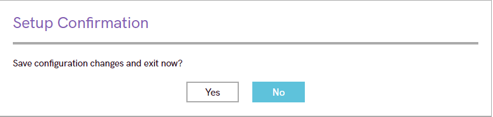

authors: Juan Pérez Ortega
summary: Guía paso a paso para el bastionado (hardening) de la BIOS/UEFI de un Lenovo 13w Gen 3, basada en la rúbrica del Criterio 6a.
id: bastionado-bios-lenovo
categories: Codelab,Security,BIOS,UEFI
environments: Web
status: Published
Feedback Link: jperrot689@g.educaand.es

# Guía de Bastionado de BIOS/UEFI: Lenovo 

## 1. Introducción
Duration: 0:02

El **bastionado** (del inglés *hardening*) de un sistema informático es el proceso de reforzar su seguridad para reducir la superficie de ataque y minimizar la exposición a amenazas. Uno de los componentes más críticos y a la vez más olvidados en este proceso es la **BIOS** (Basic Input/Output System) o su sucesor moderno, **UEFI** (Unified Extensible Firmware Interface).

La BIOS/UEFI es el firmware que se inicia antes que el sistema operativo. Controla el arranque del hardware y establece las reglas fundamentales sobre cómo puede iniciarse el dispositivo. Si un atacante logra comprometer la BIOS, puede obtener un control persistente y profundo sobre el sistema, siendo capaz de eludir la seguridad del propio sistema operativo.

En esta guía, seguiremos un procedimiento detallado para bastionar la BIOS/UEFI de un portátil **Lenovo 13w 2-in-1 Gen 3**. El objetivo es configurar el firmware para cumplir con los estándares más altos de seguridad, basándonos en la rúbrica de evaluación del **Criterio 6a**: "Se ha configurado la BIOS para incrementar la seguridad del dispositivo y su contenido minimizando las probabilidades de exposición a ataques".

Se explicará paso a paso cómo configurar contraseñas críticas, deshabilitar vectores de ataque comunes (como el arranque desde dispositivos externos) y establecer un orden de arranque seguro, utilizando el simulador gráfico proporcionado por Lenovo.

## 2. Guía de Bastionado: Pasos de Configuración

### 2.1. Indicador: Contraseña de usuario o Power-On 
Duration: 0:05

**Objetivo:** Configurar la contraseña de usuario. En este simulador, esta contraseña (User Password) actúa como la contraseña de encendido (Power-On), impidiendo que un usuario no autorizado inicie el sistema operativo.

**Procedimiento en el simulador:**

1.  Desde el menú principal, navega a la pestaña **Security**.

    

2.  Selecciona la primera opción de ese menú: **Password**. Al pulsar "Enter", accederás al submenú de contraseñas.

    

3.  Selecciona la opción **Set User Password** y pulsa "Enter".
4.  Introduce una contraseña robusta (ej. "user123") y confírmala.
5.  Ahora verás que el campo `User Password` ha cambiado de `Not Set` a `Set`.

### 2.2. Indicador: Contraseña de administrador

**Objetivo:** Configurar la contraseña de Supervisor. Esta es la "Contraseña de administrador" real, ya que protege el acceso a la configuración de la BIOS/UEFI. Sin ella, nadie puede modificar los ajustes de seguridad.

**Procedimiento en el simulador:**

1.  Permanece en el mismo submenú **Password** (donde establertaste la `User Password`).
2.  Selecciona la opción **Set Supervisor Password** y pulsa "Enter".
3.  Introduce una contraseña de administrador robusta (ej. "admin123") y confírmala.
4.  El campo `Supervisor Password` cambiará de `Not Set` a `Set`.
5.  **(Paso adicional para máxima seguridad):** En esta misma pantalla, localiza **Set Strong Password**. Cámbialo de `[Disabled]` a **`[Enabled]`**.

### 2.3. Indicador: Arranques externos
Duration: 0:03

**Objetivo:** Evitar que el sistema pueda arrancar desde dispositivos no autorizados, como memorias USB o a través de la red (PXE). Este es un vector de ataque muy común.

**Procedimiento en el simulador:**

1.  En la barra lateral izquierda, navega y selecciona la pestaña **Startup**. Al entrar, verás esta pantalla de configuración:

    

2.  En esta pantalla, selecciona **`USB Boot`** y pulsa "Enter".
3.  Cambia el valor de `[Enabled]` a **`[Disabled]`**.
4.  Vuelve a la pantalla de `Startup`, selecciona **`PXE Boot to LAN`** y pulsa "Enter".
5.  Cambia el valor de `[Enabled]` a **`[Disabled]`**.

### 2.4. Indicador: Orden de arranque 
Duration: 0:03

**Objetivo:** Establecer un orden de arranque seguro, asegurando que el sistema *solo* intente arrancar desde el disco duro interno principal donde reside el sistema operativo.

**Procedimiento en el simulador:**

1.  Permanece en la misma pestaña **Startup** (la que se muestra en tu imagen `Startup`).
2.  Selecciona la opción **Boot Order** (visible en la parte inferior de la captura `Startup`) y pulsa "Enter".
3.  Accederás a una lista de dispositivos de arranque. El objetivo es que el **disco duro principal** (identificado como `NVMe0`, `HDD0`, `Windows Boot Manager` o similar) sea la **primera y única** opción habilitada.
4.  Usando las teclas indicadas en pantalla (generalmente `+` y `-` o `F5`/`F6` para mover), **mueve** el disco duro principal a la **posición 1**.
5.  **Deshabilita** o **excluye** (a menudo con la tecla `X` o `!`) todas las demás opciones de arranque (como `USB FDD`, `USB HDD`, `Legacy LAN`, `PXE`, etc.) que deshabilitamos en el paso anterior. No basta con solo bajar su prioridad, deben ser eliminadas de la lista de arranque activo.

### 2.5. Indicador: Otras opciones de seguridad
Duration: 0:05

**Objetivo:** Configurar un conjunto de defensas avanzadas a nivel de firmware para completar el bastionado. Esto incluye habilitar el arranque seguro, la virtualización para la seguridad del SO y el bloqueo de puertos I/O.

**Procedimiento en el simulador:**

1.  Navega de vuelta al menú principal de **Security** (el que se muestra en tu captura `Security`).
2.  **Habilitar Secure Boot:**
    * Selecciona la opción **Secure Boot** y pulsa "Enter".
    * En el submenú, asegúrate de que la opción `Secure Boot` esté configurada en **`[Enabled]`**.
    * *Explicación:* Esto es crítico. Secure Boot asegura que el sistema solo pueda arrancar cargadores de sistema operativo y controladores que estén firmados digitalmente por una autoridad de confianza (ej. Microsoft). Previene eficazmente los rootkits de arranque.

        

3.  **Habilitar Virtualización:**
    * Vuelve al menú `Security` y selecciona **Virtualization**.
    * Asegúrate de que `Intel(R) Virtualization Technology` (o AMD-V) esté en **`[Enabled]`**.
    * *Explicación:* Habilitar la virtualización a nivel de BIOS es un requisito indispensable para las características de seguridad modernas de Windows 11, como *Credential Guard* y *VBS (Seguridad Basada en Virtualización)*, que aíslan procesos críticos del sistema.

        

4.  **Bloquear Puertos I/O (Opcional pero recomendado):**
    * Vuelve al menú `Security` y selecciona **I/O Port Access**.
    * Aquí puedes deshabilitar a nivel de firmware cualquier puerto que no sea necesario para la operativa del dispositivo.
    * Ejemplo: Si el portátil no va a usar la ranura para tarjetas, selecciona `USB Port` y cámbialo a **`[Disabled]`**.
    * *Explicación:* Deshabilitar puertos I/O innecesarios reduce la superficie de ataque físico contra dispositivos maliciosos (como `BadUSB` o `Rubber Ducky`).

        

### 2.6. Paso Final: Guardar Cambios y Salir
Duration: 0:01

Toda esta configuración se perderá si no se guarda correctamente al salir de la BIOS.

1.  Navega a la pestaña **Restart** en la barra lateral izquierda.
2.  Selecciona la opción **Exit Saving Changes**.
3.  Alternativamente, puedes pulsar la tecla **F10** (Save and Exit) como se indica en la parte inferior de la pantalla.
4.  El sistema mostrará un cuadro de confirmación (`Save configuration changes and exit now?`).
5.  Selecciona **`Yes`** y pulsa "Enter". El sistema se reiniciará con todas las medidas de seguridad aplicadas.

    

## 3. Conclusión

Siguiendo los pasos detallados en esta guía, hemos realizado un bastionado completo de la BIOS/UEFI del portátil Lenovo 13w 2-in-1 Gen 3, cumpliendo con todos los requisitos para la máxima puntuación (Bien - 2pt) del Criterio 6a.

Hemos establecido con éxito:
* **Contraseñas de Supervisor (Administrador) y de Usuario (Power-On)** para proteger el acceso al firmware y al arranque del equipo.
* La **deshabilitación de arranques externos (USB y PXE)** para eliminar vectores de ataque comunes.
* Un **orden de arranque seguro** que prioriza únicamente el disco del sistema operativo.
* La activación de **defensas avanzadas de firmware (Secure Boot y Virtualización)**, fundamentales para la seguridad del sistema operativo moderno.

Estas configuraciones incrementan drásticamente la seguridad del dispositivo y su contenido, minimizando las probabilidades de exposición a ataques a nivel de firmware.