# BIOS/UEFI de un dispositvo lenovo

summary: Guía paso a paso para el bastionado de seguridad de la BIOS/UEFI en portátiles Lenovo.
id: bastionado-bios-lenovo
categories: ciberseguridad, hardening, bios, uefi
tags: bios, uefi, lenovo, seguridad, firmware
status: Published
authors: Juan Pérez Ortega
feedback link: <jperort689@g.educaand.es>

## Acceder a la BIOS

Duration: 0:05:00

Para llegar hasta esta pantalla podemos hacerlo de dos maneras una muy poco comúnm y la otra forma de poder acceder es reiniciando el portatil y puslar la tecla **`F2`** justo cuando aparecía el logo de Lenovo, la otra forma es si estuvieras desde el escritorio de tu portatil abrir el siguiente comando **`shutdown /r /fw`**, cada comando hace lo siguiente.

El primero que es shutdown inicia el proceso de apago de nuestro portátil, en segundo lugar /r donde le estamos pidiendo que reinicie el sistema en vez de apagarlo y por ultimo /fw el cual accede a la BIOS/UEFI de nuestra máquina.s

En otros equipos, la tecla podría ser `Del`, `F1` o `F12`.

## La Pestaña Main

La primera pantalla que nos recibe es la pestaña `Main`.

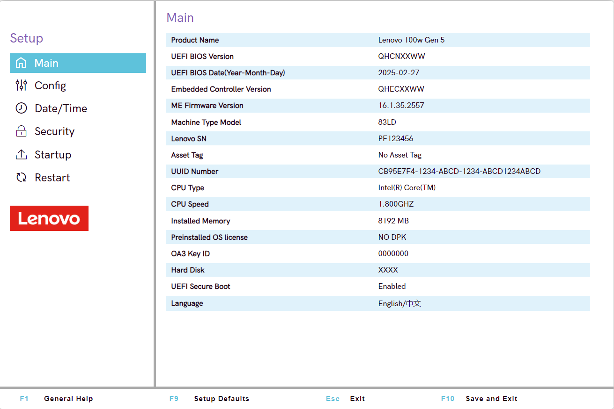

Esta pestaña es, básicamente, el "mostrador de información" de mi equipo. Aquí no se puede modificar nada, pero es **fundamental** para nuestro bastionado por dos motivos:

1. **Identificamos el equipo**: Vemos el `Product Name` (Lenovo 100w Gen 5) y el `Machine Type Model` (83LD).

2. **Revisamos el firmware**: La `UEFI BIOS Version` es **QHCNXXWW** (con fecha de 2025-02-27). La version de la BIOS/UEFI es necesaria en caso de necesitar cualquier actualización.

3. **Primer chequeo de seguridad**: En donde encontramos `UEFI Secure Boot` y marca `Enabled` el cual deberia de estar siempre activo.

Una vez visto el Main nos movemos a la siguiente pestaña que es `Config`

## La Pestaña Config

Duration: 0:10:00

Una vez finalizado con `Main` nos movemos a `Config`.

Esta pestaña es un menú que nos da acceso a varias áreas del hardware:

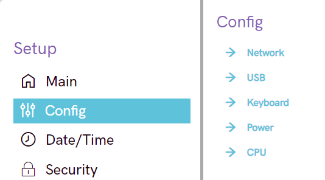

En este apartado tenemos 5 sub-secciones que son:

* **`Network`**: Opciones de la tarjeta de red.
* **`USB`**: Control sobre los puertos USB.
* **`Keyboard`**: Opciones del teclado.
* **`Power`**: Gestión de la energía.
* **`CPU`**: Configuración del procesador.

Una vez visto vamos a ir por cada una de las sub-secciones para comentar que podemos hacer en cada una de estas.

## Sub-sección Config: Network

Aquí entramos en el primer apartado de `Config`. Estas son las opciones de red:

Vemos dos opciones, ambas cruciales para el bastionado físico y de red:

1. **`MAC Address Pass Through`**: [Estado Actual: `Disabled`]
    * **Qué es**: Una función corporativa que permite que la dirección MAC de un *dock* (estación de trabajo) reemplace a la del portátil.
    * **Bastionado**: Para nuestro propósito (un servidor seguro o un equipo personal), esto es irrelevante y debe estar **`Disabled`**. Si estuviera activado, podría usarse para suplantar la identidad de red del equipo. Lo dejamos como está.

2. **`Wake On LAN from Dock`**: [Estado Actual: `Disabled`]
    * **Qué es**: La capacidad de "despertar" (encender) el portátil de forma remota enviando un paquete de red a través del *dock*.
    * **Bastionado**: ¡Aquí sí hay chicha! Un atacante en nuestra red podría enviar este paquete para encender el equipo y atacarlo cuando no estamos mirando.

Ambas opciones ya están en `Disabled`, que es la configuración más segura. No permitimos que el equipo se encienda remotamente ni que se manipule su dirección MAC.

En este caso no tenemos que tocar nada, pasemos a la siguiente sub-sección.

## Sub-sección Config: USB

Duration: 0:03:00

Accedemos al apartado del USB.

Cambiar de **Enable** a **disabled**

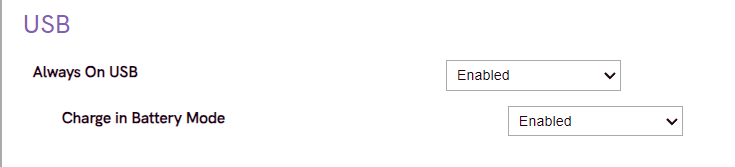

Cambio hecho a **Disabled**

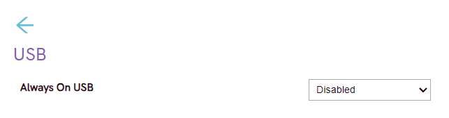

1. **`Always On USB`**: [Estado Actual: `Enabled`]
    * **Qué hace**: Permite que los puertos USB den energía mientras el portátil está apagado (pero conectado a la corriente).
    * **Bastionado**:Esto puede ser un vector para ataques de hardware como "USB Killers" o dispositivos maliciosos que se alimentan solos.

2. **`Charge in Battery Mode`**: [Estado Actual: `Enabled`]
    * **Qué hace**: Lo mismo, pero tirando de batería. Aún peor.
    * **Bastionado**: Misma razón y encima gasta batería.

* Cambia **`Always On USB`** a **`Disabled`**.
* Cambia **`Charge in Battery Mode`** a **`Disabled`**.

En este caso si teniamos que hacer cambios para no permitir ningun tipo de ataque físico como ya hemos dicho anteriormente. Después de estos cambios de configuración pasamos a la siguiente sub-sección.

## Sub-sección Config: Keyboard

Duration: 0:01:00

Accedemos al apartado del Keyboard

Tenemos dos opciones que definen cómo se comportan las teclas de función:

1.**`F1-F12 as Primary Function`**: [Estado Actual: `Disabled`]
    **Qué es**: Esto decide qué pasa cuando pulsas una tecla F (F1, F2, etc.). Estando `Disabled`, la función primaria es la del "dibujito" (bajar volumen, brillo, modo avión). Para usar `F5` (actualizar), tendrías que pulsar `Fn + F5`.
    * **Bastionado**: Irrelevante para la seguridad. Es pura preferencia del usuario. Si vas a usar mucho la terminal o aplicaciones que dependen de las teclas F, querrás ponerlo en `Enabled`.

2.**`Fool Proof Fn Ctrl`**: [Estado Actual: `Enabled`]
    **Qué es**: Estando `Enabled` *evita* que el usuario active el *"Fn Lock"* (`Fn + Esc`), que es lo que intercambia las funciones primarias y secundarias de las teclas F sobre la marcha. Esto puede ser el vez de usar  la tecla *F5* para actualizar deberiamos de usar *F5 + Fn* para poder actualizar en vez de cambiar la iluminación del teclado.
    **Bastionado**: Solo sirve para evitar que un usuario cambie accidentalmente el comportamiento del teclado. En cuanto a seguridad no hay ningún tipo de problema.

Como ninguna de estas opciones afecta a la superficie de ataque del sistema, no se requiere ningún cambio. Lo documentamos y seguimos.

## Sub-sección Config: Power

Duration: 0:02:00

Siguiente parada, `Power`. Aquí hay que leer con atención, porque una de las opciones no es un ajuste, sino un comando de mantenimiento.

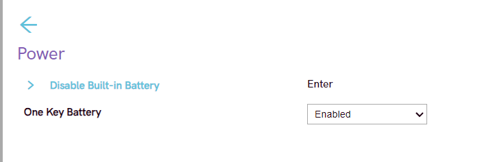

Vamos a analizar qué vemos:

1. **`Disable Built-in Battery`**:
    * **Qué es**: Si pulsas `Enter` la BIOS desconecta la batería a nivel de hardware. Está pensado para que un técnico pueda abrir el portátil de forma segura sin provocar un cortocircuito.
    * **Bastionado**: No es necesario tocar la bateria ya que estamos con la configuracion y no tenemos que abrir el portátil

2. **`One Key Battery`**: [Estado Actual: `Enabled`]
    * **Qué es**: Esta es una función específica de Lenovo, probablemente ligada a su software "One Key". Suele permitir que la batería alimente alguna función (como un botón de recuperación) incluso con el equipo apagado.
    * **Bastionado**: Esto sigue la misma lógica que `Always On USB`. No queremos que "nada" tenga energía o esté "escuchando" cuando el sistema está apagado. Es una superficie de ataque innecesaria.

Podemos desconectarlo ya que no es esencial.

Pasamos a la última sub-sección del apartado de "Config".

## Sub-sección Config: CPU

Duration: 0:03:00

Llegamos al último apartado de `Config`: el cerebro de la bestia, la CPU. Y aquí nos encontramos con una de las decisiones de bastionado más clásicas (y polémicas).

Solo hay una opción, pero es una muy importante:

1. **`Intel(R) Hyper-Threading Technology`**: [Estado Actual: `Enabled`]
    * **Qué es**: Es la tecnología de Intel que hace que un solo núcleo físico de la CPU pueda comportarse como dos núcleos lógicos (hilos). En resumen: `Enabled` = más rendimiento multitarea. `Disabled` = un núcleo físico.
    * **Bastionado**: El Hyper-Threading ha sido históricamente la fuente de varias vulnerabilidades de seguridad graves (como MDS, Zombieload...). Estas vulnerabilidades, en teoría, podían permitir a un proceso malicioso "espiar" datos de otro proceso que se esté ejecutando en el hilo "hermano" (el que comparte el mismo núcleo físico).

En un entorno de máxima seguridad (hardening), la regla es clara: **la seguridad está por encima del rendimiento**. Deshabilitar el Hyper-Threading cierra la puerta a toda esa familia de vulnerabilidades de canal lateral.

* Cambiamos **`Intel(R) Hyper-Threading Technology`** a **`Disabled`**.

Una vez finalizado con el apartado de "Config" accedemos a "Date/Time".

## Date/Time

Duration: 0:02:00

Nos encontramos en un apartado en donde vemos la fecha y hora.

1. **`System Date`**: [Valor Actual: November 05, 2025]
2. **`System Time`**: [Valor Actual: 23:53:55]

**¿Por qué esto es seguridad?**
Toda la criptografía (cifrado, certificados SSL/TLS, firmas de código) depende de marcas de tiempo. Si la hora de nuestra BIOS estuviese mal como por ejemplo 5 de Noviembre de 2001 el sistema operativo no podria hacer ningún tipo de actualización  y los logs de seguridad serían "inservibles" ya que no se encuentra en la fecha actual.

**Necesita una acción de bastioanado**
Debemos de asegurarnos de que la fecha (`System Date`) y la hora (`System Time`) son **exactas** para nuestra zona horaria como por ejemplo si viviesemos en España deberiamos de poner la fecha y hora.

## Paso 4: La Pestaña 'Security'

Duration: 0:02:00

Accedemos a una parte importante dentro de nuestra BIOS/UEFI que es **Security**

Este es, sin duda, el apartado más importante de toda la BIOS. Aquí es donde pondremos las barreras de entrada. Como ves, hay *mucho* que revisar. Este es el plan de ataque:

* **`Password`**: Sirve para estableces las contraseñas de la BIOS.
* **`Security Chip`**: Configuraremos el chip TPM (Trusted Platform Module).
* **`UEFI BIOS Update Option`**: Un apartado muy importante en el cual decidimos quien puede actualizar la BIOS.
* **`Virtualization`**: Activaremos las funciones de virtualización.
* **`I/O Port Access`**: Deshabilitaremos que no estemos o no vayamos a usar.
* **`Absolute Persistence(R) Module`**: Desactivaremos un posible "agujero de seguridad legal".
* **`Secure Boot`**:En pocas palabras el arranque seguro el cual solo usará software firmado y certificado por un proveedor de confianza.
* **`Secure Wipe`**: Una herramienta para borrar discos de forma segura.
* **`Reset system to Factory Defaults`**: En caso necesario resetar el sistema al completo.

En los siguientes apartados veremos como "reforzar nuestro castillo".

Empezamos por la primera línea de defensa.

## Sub-sección Security: Password

Duration: 0:05:00

Ingresamos al primer apartado de `Security`. Esta sección es la línea de defensa fundamental contra el acceso físico no autorizado al firmware del sistema.

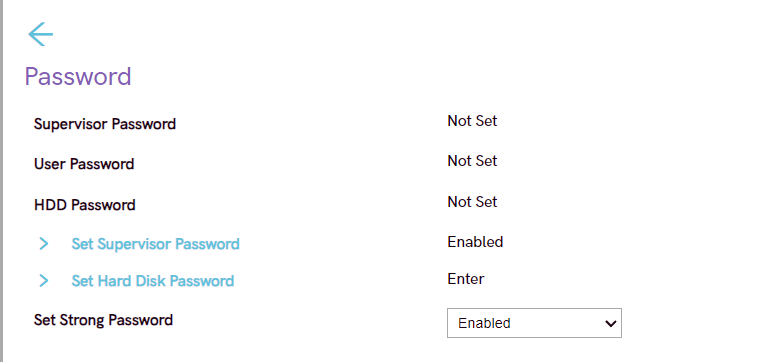

Analicemos las opciones y su estado actual:

1. **`Supervisor Password`**: [Estado Actual: `Not Set`]
    * **Descripción**: Esta es la contraseña de administrador de la BIOS. Si se establece, se requerirá para realizar *cualquier* cambio en la configuración de la BIOS (como los que estamos haciendo ahora).
    * **Bastionado**: Es **obligatorio** establecer esta contraseña. Sin ella, cualquier persona con acceso físico puede revertir todas nuestras configuraciones de seguridad.

2. **`User Password`**: [Estado Actual: `Not Set`]
    * **Descripción**: Esta contraseña (también conocida como "Power-On Password") se solicita al usuario cada vez que se enciende el equipo, *antes* de que cargue el sistema operativo.
    * **Bastionado**: Altamente recomendado. Añade una capa de autenticación previa al arranque.

3. **`HDD Password`**: [Estado Actual: `Not Set`]
    * **Descripción**: Esto establece una contraseña en el firmware del disco duro (si es compatible, como los HDD/SSD SATA). Esta contraseña es independiente del cifrado del sistema operativo (como LUKS o BitLocker).
    * **Bastionado**: Recomendado como una capa adicional, aunque el cifrado de disco a nivel de SO (que veremos en el proyecto de Ubuntu) es más robusto.

4. **`Set Strong Password`**: [Estado Actual: `Enabled`]
    * **Descripción**: Esta política fuerza que las contraseñas de Supervisor y Usuario cumplan con requisitos de complejidad (longitud, mezcla de caracteres, etc.).
    * **Bastionado**: **Mantener `Enabled`**. Esto es una buena práctica de seguridad.

Negative: **Acción de Bastionado Requerida**
El estado actual (`Not Set`) es inaceptable para un sistema bastionado.

1. Seleccione **`Set Supervisor Password`**, pulse `Enter` y establezca una contraseña robusta. Anótela y guárdela en un lugar seguro (gestor de contraseñas). **Esta es la acción más importante de toda la guía.**
2. (Opcional, pero recomendado) Seleccione **`User Password`** y establezca una contraseña de arranque.
3. Asegúrese de que **`Set Strong Password`** permanece en **`Enabled`**.

## Sub-sección Security: Security Chip

Duration: 0:04:00

Continuamos en `Security`. Esta sección gestiona el **Trusted Platform Module (TPM)**, un componente de hardware esencial para la criptografía moderna y la seguridad del sistema.

El TPM es un "criptoprocesador" seguro diseñado para almacenar claves de cifrado, huellas de arranque (para `Secure Boot`) y otros datos sensibles.

1. **`Intel Platform Trust Technology` (PTT)**: [Estado Actual: `Enabled`]
    * **Descripción**: Esta es la versión de TPM de Intel basada en firmware (fTPM). Utiliza el propio procesador para realizar las funciones de un TPM.

2. **`Security Chip`**: [Estado Actual: `Enabled`]
    * **Descripción**: Esto se refiere a un chip TPM discreto (dTPM), un componente físico separado en la placa base. Generalmente se considera más seguro que un fTPM al estar físicamente aislado de la CPU.

3. **`Clear Intel PTT Key` / `Clear Security Chip Key`**:
    * **Descripción**: Estas son **acciones**, no ajustes. Al ejecutarlas, se borran permanentemente las claves de cifrado almacenadas en el TPM correspondiente.

**Acción de Bastionado Requerida**
Un sistema no debe tener dos TPMs activos. Debemos seleccionar el más robusto y limpiar su estado.

1. **Seleccione una fuente de TPM**: El `Security Chip` (dTPM) es la opción preferible. Cambie **`Intel Platform Trust Technology`** a **`Disabled`**.
2. **Mantenga** **`Security Chip`** en **`Enabled`**.
3. **Acción Crítica (pre-instalación)**: Antes de instalar un nuevo sistema operativo (como el Ubuntu Server de su proyecto), es vital "tomar posesión" del TPM. Para ello, ejecute la acción **`Clear Security Chip Key`** (pulsando `Enter` sobre ella). Esto borrará cualquier clave o "propietario" anterior, permitiendo que el nuevo SO lo inicialice de forma limpia.

## Sub-sección Security: UEFI BIOS Update Option

Duration: 0:03:00

Esta sección es de vital importancia, ya que protege a la propia BIOS contra manipulaciones y ataques de *downgrade* (reversión a una versión anterior).

Analicemos las políticas de actualización:

1. **`Secure RollBack Prevention`**: [Estado Actual: `Enabled`]
    * **Descripción**: Impide que se pueda instalar una versión de BIOS *anterior* a la actual.
    * **Bastionado**: Esta es una función de seguridad crítica. Los atacantes a menudo intentan revertir a versiones de firmware antiguas que contienen vulnerabilidades conocidas. Mantener esto en `Enabled` bloquea ese vector de ataque.

2. **`BIOS Self-Healing`**: [Estado Actual: `Enabled`]
    * **Descripción**: Una función de resiliencia. El sistema puede detectar si el firmware de la BIOS está corrupto (debido a un flasheo fallido o malware) y restaurarlo automáticamente desde una copia de seguridad protegida.
    * **Bastionado**: Es una medida de seguridad y estabilidad excelente. Debe permanecer `Enabled`.

3. **`BIOS Firmware Update`**: [Estado Actual: `Local Storage`]
    * **Descripción**: Define el *método* permitido para actualizar la BIOS. `Local Storage` implica que la actualización debe realizarse desde un dispositivo local (ej. USB o el disco duro).
    * **Bastionado**: Esta configuración es aceptable y preferible a una actualización por red, que podría ser suplantada. La acción de actualizar (flashear) la BIOS está protegida por la `Supervisor Password` que establecimos en el `Paso 4.1`, por lo que un actor malicioso no podría flashear una imagen sin esa contraseña.

 **Configuración Verificada.**
El estado actual de estas opciones es el correcto para un sistema bastionado. No se requiere ninguna acción, solo verificar que `Secure RollBack Prevention` y `BIOS Self-Healing` estén activados.

## Sub-sección Security: Boot Order

Duration: 0:03:00

Ingresamos al sub-menú `Boot Order`. Esta pantalla es el "director de orquesta" del arranque.

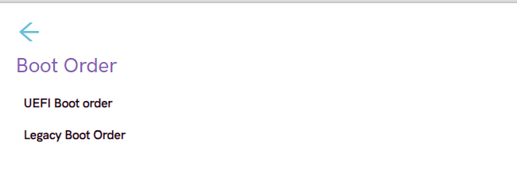

Aquí se definen las dos filosofías de arranque que el sistema puede seguir:

1. **`UEFI Boot order`**:
    * **Descripción**: El modo de arranque moderno, seguro y estándar actual. Es el único modo que soporta funciones críticas como `Secure Boot`.
    * **Bastionado**: Este es el único modo que debemos permitir. Al ingresar aquí (aunque en esta simulación no se muestre), debemos asegurarnos de que la primera y única opción de arranque sea el gestor de arranque del sistema operativo principal (ej. `Windows Boot Manager` o `ubuntu`).

2. **`Legacy Boot Order`**:
    * **Descripción**: El modo de arranque obsoleto. No soporta `Secure Boot` y es más vulnerable a *rootkits* de arranque.
    * **Bastionado**: La presencia de esta opción implica que el modo "Legacy" podría estar activado. Un sistema bastionado debe operar en modo **UEFI exclusivo**.

En este apartado debemos de tener en cuenta lo siguiente:

* El sistema debe estar configurado en **modo UEFI solamente**.
* Se debe **deshabilitar cualquier compatibilidad con "Legacy" o CSM** (Compatibility Support Module) en la BIOS. (Esto suele estar en la pestaña `Startup` o `Boot`).
* Dentro del `UEFI Boot order`, el disco del sistema (`NVMe SSD`, `Windows Boot Manager`, `ubuntu`, etc.) debe ser la **opción número 1**, y el resto de dispositivos (USB, Red) deben estar deshabilitados o eliminados de la lista.

## Sub-sección Security: Virtualization

Duration: 0:02:00

Esta sección activa las extensiones de hardware para virtualización. Son esenciales para la seguridad moderna.

1. **`Intel(R) Virtualization Technology` (VT-x)**: [Estado: `Enabled`]
    * **Descripción**: Es la virtualización de CPU. Requerida por hipervisores (Hyper-V, KVM) y funciones de seguridad como Windows VBS o WSL2.
    * **Bastionado**: **Mantener `Enabled`**.

2. **`Intel(R) VT-d Feature`**: [Estado: `Enabled`]
    * **Descripción**: Es la virtualización de E/S (I/O). Permite al SO gestionar el acceso a hardware (DMA) de forma segura.
    * **Bastionado**: **Mantener `Enabled`**. Es una protección crítica contra ataques de DMA (Direct Memory Access).

Positive: **Configuración Verificada.**
El estado actual es el correcto. Ambas opciones son necesarias para un sistema operativo moderno y seguro.

## Sub-sección Security: I/O Port Access

Duration: 0:04:00

Esta sección es la definición de "bastionado físico". Nos permite deshabilitar hardware a nivel de firmware, haciendo imposible que el sistema operativo (o malware) pueda acceder a él.

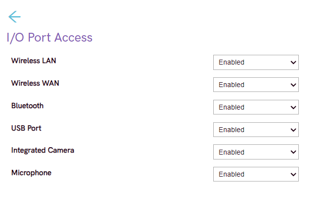

El principio aquí es simple: **Si no se usa, se deshabilita.**

**Acción de Bastionado Requerida**
El estado actual (`Enabled` en todo) es una puerta abierta. La política de bastionado depende del rol del equipo:

* **`Integrated Camera`**: [Acción: `Disabled`]
  * Vector principal de spyware. Un servidor no necesita cámara.

* **`Microphone`**: [Acción: `Disabled`]
  * Igual que la cámara. Lo deshabilitamos a nivel de hardware.

* **`Wireless WAN`**: [Acción: `Disabled`]
  * Un módulo 4G/LTE. Es un vector de ataque de red innecesario.

* **`Bluetooth`**: [Acción: `Disabled`]
  * Vector de ataque de corto alcance. Innecesario para un servidor.

* **`Wireless LAN`**: [Acción: `Disabled` (Recomendado)]
  * Para un servidor, la conexión debe ser cableada (`LAN`). Deshabilitar la WiFi elimina un vector de ataque de red completo.

* **`USB Port`**: [Acción: ¡Decisión Importante!]
  * Este es el vector de ataque físico más peligroso (BadUSB, robo de datos, etc.).
  * **Problema:** Necesitará el puerto USB para instalar Ubuntu Server desde una memoria.
    * **Política:** Dejar `Enabled` *solo* para la instalación. Una vez el servidor esté en producción, un administrador debería volver a entrar aquí y ponerlo en `Disabled` para un bastionado completo.

## Sub-sección Security: Absolute Persistence(R) Module

Duration: 0:02:00

Esta es una tecnología de seguridad antirrobo (como LoJack) que puede sobrevivir a reinstalaciones del SO. Para un bastionado de servidor, es un "agente externo" en nuestro firmware.

1. **`Absolute Persistence(R) Module Activation`**: [Estado: `Enabled`]
    * **Descripción**: El módulo está `Enabled` (listo para ser activado) pero su `Current State` es `Not Activated`. Si se activara, se conectaría a un servicio en la nube.
    * **Bastionado**: No queremos *ningún* software de terceros ejecutándose a este nivel. Es una puerta trasera, aunque sea "legítima". La única política de seguridad aquí es la nuestra.

**Acción de Bastionado Requerida**
Debe ser deshabilitado permanentemente.

* Cambie **`Absolute Persistence(R) Module Activation`** a **`Disabled`**.

## Sub-sección Security: Security - Secure Boot

Duration: 0:04:00

Llegamos a la característica de seguridad de arranque más importante de UEFI. `Secure Boot` valida criptográficamente que solo se ejecuta software de arranque (como el gestor de arranque del SO) firmado por una clave de confianza.

Analicemos la configuración:

1. **`Secure Boot`**: [Estado: `Enabled`]
    * **Descripción**: El interruptor maestro. Debe estar activado para que funcione el arranque seguro.
    * **Bastionado**: **Mantener `Enabled`**.

2. **`Secure Boot Mode`**: [Estado: `User Mode`]
    * **Descripción**: Es el modo operacional estándar. El modo alternativo (`Setup Mode`) se usa para instalar nuevas claves.
    * **Bastionado**: **Mantener `User Mode`**.

3. **`Allow Microsoft 3rd Party UEFI CA`**: [Estado: `Disabled`]
    * **Descripción**: Esta es la Autoridad de Certificación (CA) de terceros de Microsoft. Es la clave que se utiliza para firmar la gran mayoría de gestores de arranque de **Linux**, incluyendo **Ubuntu**.

Negative: **Acción de Bastionado Requerida (Crítica para el Proyecto)**
La configuración actual (`Disabled`) es correcta para un sistema que *solo* vaya a ejecutar Windows, pero **impedirá que el instalador de Ubuntu arranque**.

Dado que el objetivo de este proyecto (según sus metadatos) es instalar `Ubuntu Server`:

* Cambie **`Allow Microsoft 3rd Party UEFI CA`** a **`Enabled`**.
* Verifique que **`Secure Boot`** permanece en **`Enabled`**.

## Paso 4.8: Security - Secure Wipe

Duration: 0:02:00

Esta sección no es un ajuste de seguridad pasivo, sino una herramienta de saneamiento de datos.

1. **`Wipe Storage Devices`**: [Es una ACCIÓN, no un ajuste]
    * **Descripción**: Al ejecutar esta acción, se inicia un borrado seguro (usando comandos ATA Secure Erase, por ejemplo) del dispositivo de almacenamiento (SSD/HDD). Esto borra todos los datos de forma irrecuperable.
    * **Bastionado**: Esta herramienta no es un ajuste que se "deja puesto". Es algo que se *usa* en un momento concreto.

Positive: **Información de Bastionado**
No hay nada que *configurar* aquí. Sin embargo, es una herramienta vital:

* **Antes de instalar el SO:** Si este equipo no es nuevo, es una práctica excelente ejecutar un `Secure Wipe` para eliminar cualquier resto de datos o malware a nivel de disco del sistema anterior.
* **Al retirar el equipo (decommissioning):** Antes de desechar o reasignar el hardware, se debe ejecutar esta acción para garantizar que no haya fugas de datos.

**Nota:** La `Supervisor Password` que establecimos debería bloquear el acceso no autorizado a esta herramienta.

## Paso 4.9: Security - Reset to Factory Defaults

Duration: 0:01:00

Esta es la opción final en `Security` y es, esencialmente, el "botón del pánico" que borra todo nuestro trabajo.

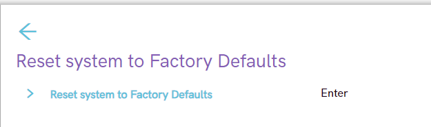

1. **`Reset system to Factory Defaults`**: [Es una ACCIÓN, no un ajuste]
    * **Descripción**: Al ejecutar esta acción, se borran todas las configuraciones de la BIOS (incluyendo las de `Config`, `Startup` y `Security`) y se restauran los valores que traía el equipo de fábrica.
    * **Bastionado**: Esta es la amenaza principal contra nuestro bastionado. Un actor malicioso con acceso físico podría usar esto para borrar nuestra `Supervisor Password` (si no estuviera bien puesta) y deshabilitar `Secure Boot`.

Positive: **El Escudo Protector**
No hay nada que *configurar* aquí. Esta opción es la razón principal por la que el **`Paso 4.1: Security - Password`** fue tan crítico.

Si ha establecido una `Supervisor Password` robusta, un atacante **no podrá ejecutar** esta acción. Se le pedirá la contraseña, y al no tenerla, no podrá borrar nuestro bastionado.

## La Pestaña Startup (Control de Arranque)

Duration: 0:05:00

Pasamos a la pestaña `Startup`. Esta sección controla qué dispositivos tienen permiso para iniciar un sistema operativo, convirtiéndose en un punto de control de seguridad crítico.

Analicemos las opciones de arranque de dispositivos:

1. **`USB Boot`**: [Estado Actual: `Enabled`]
    * **Descripción**: Permite que el sistema arranque desde un dispositivo conectado por USB (memoria USB, disco duro externo).
    * **Bastionado**: Esta es una de las vulnerabilidades físicas más comunes. Estando `Enabled`, un atacante con acceso físico puede arrancar un sistema operativo "live" (ej. Kali Linux) desde un USB, saltarse la seguridad del SO instalado y acceder o modificar los datos del disco.

2. **`PXE Boot to LAN`**: [Estado Actual: `Enabled`]
    * **Descripción**: Permite que el sistema arranque desde la red (Preboot Execution Environment). Se usa en entornos corporativos para desplegar imágenes de sistema.
    * **Bastionado**: Para un servidor o equipo individual bastionado, esto es un vector de ataque de red. Un servidor PXE malicioso en la misma red podría forzar al equipo a arrancar una imagen comprometida.

3. **`IPV4 PXE First`**: [Estado Actual: `Enabled`]
    * **Descripción**: Prioriza la versión IPv4 de PXE. Es una sub-opción de la anterior.
    * **Bastionado**: Irrelevante si se deshabilita `PXE Boot to LAN`.

Negative: **Acción de Bastionado Requerida**
En el estado actual permite múltiples vectores de ataque como acabamos de comentar. Para ello debemos restringir el arranque *únicamente* al disco duro interno de nuestro sistema operativo.

* Cambiamos **`USB Boot`** a **`Disabled`**.
* Cambiamos **`PXE Boot to LAN`** a **`Disabled`**.
* La opción **`IPV4 PXE First`** ,Se deshabilitará por completitud si la BIOS lo permite tras la acción anterior, en nuestro caso si fue posible como observamos en la última imágen.

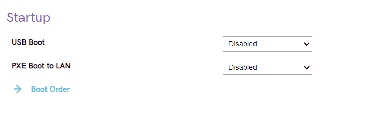

Una vez hecho este apartado accedemos a la sub-sección en donde encontramos Boot Order

Una vez finalizado con el apartado de Boot Order finalizamos con Restart

## La Pestaña Restart: (El Menú de Salida)

Duration: 0:02:00

Hemos alcanzado la última pestaña, `Restart`. Esta sección es el "mostrador de salida" de la BIOS; aquí no se configura nada, pero se ejecutan las acciones finales.

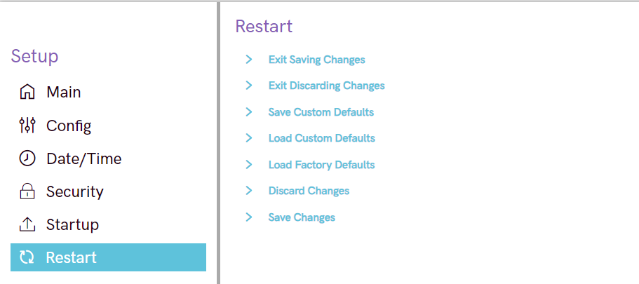

Es fundamental comprender qué hace cada opción antes de seleccionarla:

1. **`Exit Saving Changes`**:
    * **Descripción**: Esta es la opción estándar para **guardar y salir** (comúnmente pulsando `F10`). Al seleccionarla, todos los cambios de bastionado que hemos configurado (`Disabled` en USB, `Disabled` en WakeOnLAN, etc.) se escribirán en la memoria (NVRAM) y el sistema se reiniciará con las nuevas políticas aplicadas.

2. **`Exit Discarding Changes`**:
    * **Descripción**: La "salida de emergencia". Esta opción reinicia el sistema **ignorando** todos los cambios que hemos hecho en esta sesión. Es útil si hemos cometido un error y no estamos seguros de qué hemos modificado.

3. **`Load Factory Defaults`**:
    * **Descripción**: Revierte *toda* la configuración de la BIOS a su estado de fábrica.
    * **Bastionado**: Esta es una opción de riesgo. Un atacante con acceso físico podría usarla para borrar todo nuestro bastionado. Esta es la razón principal por la que establecer una **`Supervisor Password`** (en la pestaña `Security`) es tan crítico: bloquea el acceso a esta y otras funciones.

**Paso de Confirmación**
No es un paso de bastionado en sí mismo, sino el paso de **confirmación**. Una vez que hayamos completado todas las configuraciones (incluyendo la pestaña `Security`), volveremos aquí y seleccionaremos **`Exit Saving Changes`** para aplicar nuestro trabajo.

## Conclusión

* **NECESARIO (Activar):** `Supervisor Password` (la clave de todo), `Secure Boot` (con clave 3rd Party para Linux), el `TPM` (Security Chip) y la `Virtualization (VT-d)`.
* **NECESARIO (Corregir):** La `Fecha y Hora` deben ser exactas, o nada de criptografía funcionará.
* **NO NECESARIO (Desactivar):** `USB Boot` y `PXE Boot` (arranque por red) para evitar arranques externos.
* **NO NECESARIO (Desactivar):** `Hyper-Threading` (prioriza seguridad sobre rendimiento) y agentes externos como `Absolute Persistence`.
* **NO NECESARIO (Desactivar):** Todo el *hardware* físico que no se use (Cámara, Micrófono, Bluetooth, WiFi) desde el `I/O Port Access`.
